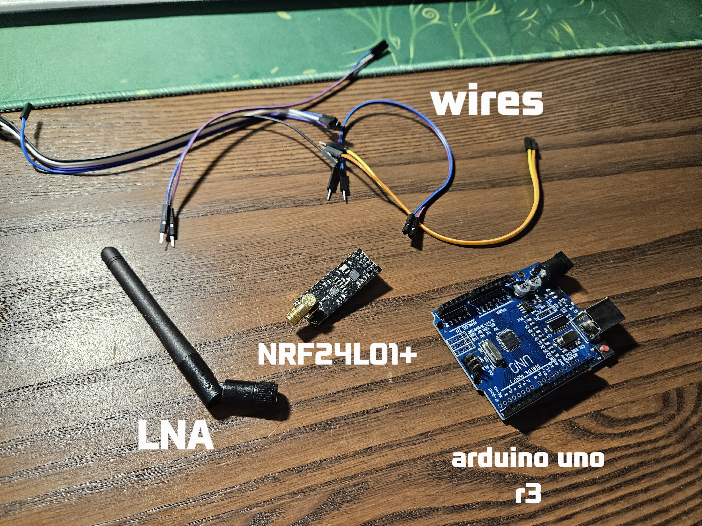
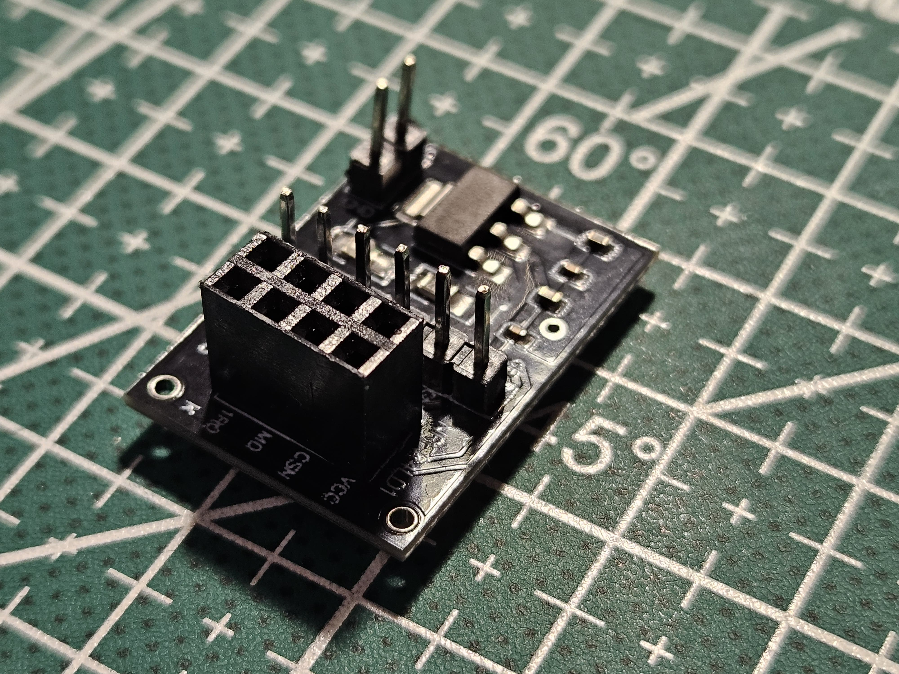
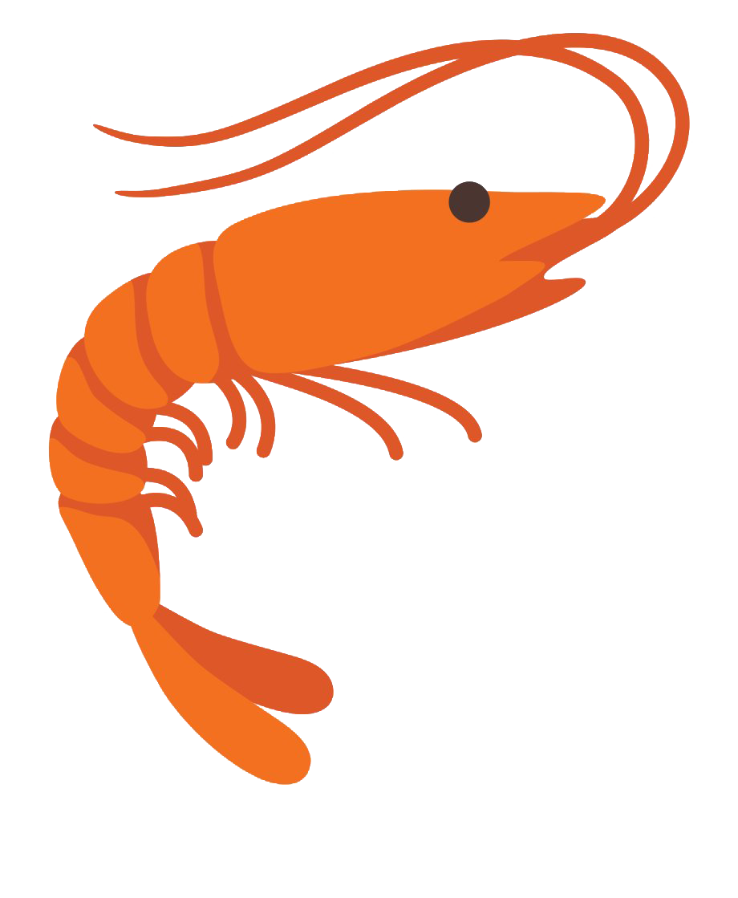

# Check your network usage with NRF24L01+

## Overview
**File structure**: 
- .jpegs and .png are just pictures, ignore them.
- Folders contain source code
- README.md is this file
<p>This project was created for searching and analysing the nearby network. Handy for some remote-controlled cars, drones, and other things.</br> So, first of all, are the parts. You need an Arduino (I used Uno R3, but you can use another), some jumper wires, and the NRF24L01+LNA. </p>

<p>Also, you can use this NRF24L01 </br>adapter, but make sure to connect it to 5V and not 3.3V</p>


---

## Connections
Now you need to connect all this together.
- **CE → D9**
- **CSN → D10**
- **MOSI → D11**
- **MISO → D12**
- **SCK → D13**
- **VCC → 3.3V (DO NOT connect VCC straight to the 5V otherwise NRF24L01 will be fried, use an adapter)**
- **GND → GND**
---
## Coding

### Test code (nrf24l01_check)
Upload this code to your Arduino for nrf module testing. You can view output in the serial monitor
```cpp
#include <SPI.h>
#include <nRF24L01.h> // install or update these libs
#include <RF24.h>

#define CE_PIN 9
#define CSN_PIN 10

RF24 radio(CE_PIN, CSN_PIN);

void setup() {
  Serial.begin(9600);
  
  if (!radio.begin()) {
    Serial.println("NRF24L01 is not working. Check the connections or power supply");
    while (true);
  } else {
    Serial.println("NRF24L01 is working now!!");
  }
} 

void loop() {
  // nothing
}
```
### Main code (network-check)
This is the main code. You can copy it from here or download the whole project with source code.
```cpp
#include <SPI.h>
#include <nRF24L01.h>
#include <RF24.h>

#define CE_PIN 9
#define CSN_PIN 10

RF24 radio(CE_PIN, CSN_PIN);

void setup() {
  Serial.begin(9600);
  
  if (!radio.begin()) {
    Serial.println("NRF24L01 is not working");
    while (true);
  }
  Serial.println("Scanning the channels...");
  Serial.println("Channel | Data");
}

void loop() {
  const int numChannels = 126;
  uint8_t values[numChannels];

  // Scanning all the channels
  radio.startListening();
  for (int i = 0; i < numChannels; i++) {
    radio.setChannel(i);
    delay(2);
    values[i] = radio.testCarrier() || radio.testRPD();
  }
  radio.stopListening();
  
  for (int i = 0; i < numChannels; i++) {
    Serial.print("  ");
    Serial.print(i);
    Serial.print("   |   ");
    Serial.println(values[i] ? "Taken" : "Free"); // Free means the channel is free, taken means it is already taken by some device
  }

  Serial.println("-------------------------------");

  delay(5000); // Delay before checking again

}
```
---
That's all.

